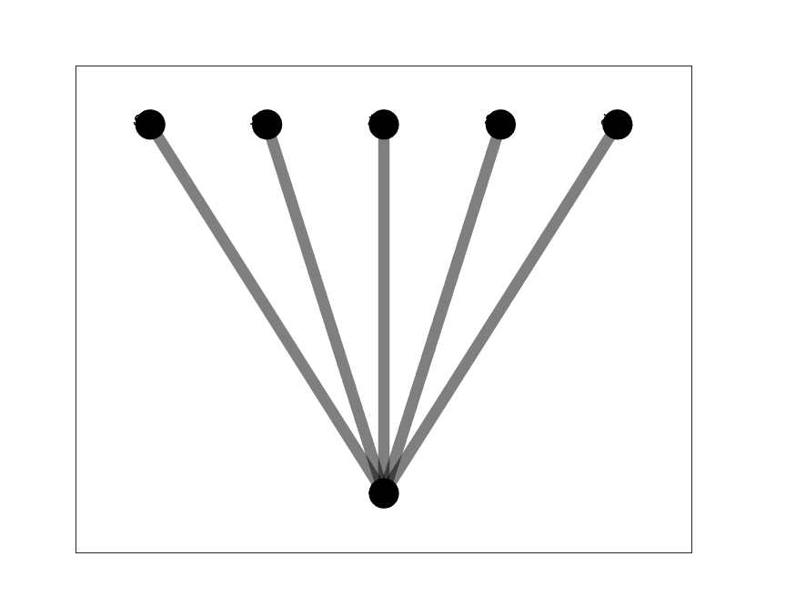

# Topology Classification
This is a topology classification training and inference code using the pretrained ResNet18, ResNet152 and ResNeXt-101-32x8d.

When you input the image of topology, this network predicts how many nodes there are in this image.

The number of class is six. This means that an image with 3, 4, 5, 6, 7, and 8 nodes is used.

## Our data set configuration
Data Set is made by Yoon Kyung Jang (jokjjs0216@khu.ac.kr)

Image(.png) + label(.txt) -> preprocessing -> image+label(.json)

Data set link: https://drive.google.com/file/d/1gqCReEtbO1N2glrRoKS4yF1wi-bjBQY0/view?usp=sharing

The number of total data set: 1854

### Example of data set
#### Node 5 image
</img><br/>

#### Node 6 image
</img><br/>

## Network(ResNet18,158,ResNeXt-101-32x8d)
[ResNet]

link: https://pytorch.org/hub/pytorch_vision_resnet/

[ResNeXt]

link: https://pytorch.org/hub/pytorch_vision_resnext/

### Pretrained Weight File
* ResNet-18

learning rate: 0.001

BatchSize = 128

ADAM OPTIMIZATION + 500 epoch:  https://drive.google.com/file/d/1ObSv2HAQmSg0a64RIsANfUyCr-UcNhCS/view?usp=sharing

SGD OPTIMIZATION + 500 epoch:  https://drive.google.com/file/d/15mNr7ogmzTCFd43VuTbC31P38OPjaKlx/view?usp=sharing

* ResNet-152

learning rate: 0.001

BatchSize = 128

ADAM OPTIMIZATION + 500 epoch:  https://drive.google.com/file/d/10XJcF7JV9sg6Qo-reLcfKLWNZ2w8_nvv/view?usp=sharing

SGD OPTIMIZATION + 500 epoch:  https://drive.google.com/file/d/1NzEVaLiwZQstfYVro9baepfHjYKxxuUT/view?usp=sharing

* ResNeXt-101-32x8d

learning rate: 0.001

BatchSize = 128

ADAM OPTIMIZATION + 500 epoch:  https://drive.google.com/file/d/1wfWYjHXwn7exmmoVVOl5_F56sd7AFozM/view?usp=sharing

SGD OPTIMIZATION + 500 epoch:  https://drive.google.com/file/d/15zWFLU8iepmypS_oQ0yCYry-Agla6SLM/view?usp=sharing

## How to run this code
0. Download this git storage
```bash
git clone https://github.com/swhan0329/topology_classification.git
```

1. Set the envirnment
```bash
pip install -r requirements.txt
```

2. Preprocess

```bash
python create_data.py \
-i [input image directory] #(<image input dir>/*.png) \
-l [label information in text file] #(<label input dir>/*.txt) \
-o [output directory]
```

3. Train and validation

```bash
python main.py
```

4. Test(Inference)

```bash
python inference.py -i [input image] -w [weight file]
```

## Result
### Inference Time

Specification: One Nivida TITIN RTX

|         Second        | Adam Optimizer |     SGD     |
| :-------------------: | :------------: | :----------:|
| **ResNet-18**         | 0.02734        | 0.02777     |
| **ResNet-152**        | 0.46982        | 0.04122     |
| **ResNeXt-101-32x8d** | 0.04609        | 0.05990     |

### Best Accuracy
|                       | Adam Optimizer |     SGD     |
| :-------------------: | :------------: | :----------:|
| **ResNet-18**         | 0.773218       | 0.753780    |
| **ResNet-152**        | 0.792657       | 0.775378    |
| **ResNeXt-101-32x8d** | 0.775378       | 0.773218    |

### Train vs. Validation accuracy graph
#### ResNet18
* Adam Optimization

</img><br/>

* SGD Optimization

</img><br/>

#### ResNet152
* Adam Optimization

</img><br/>

* SGD Optimization

</img><br/>

#### ResNeXt-101-32x8d
* Adam Optimization

</img><br/>

* SGD Optimization

</img><br/>

## Q & A
If you have a question, make issue or send e-mail to me.

E-mail: swhan0329@gmail.com
